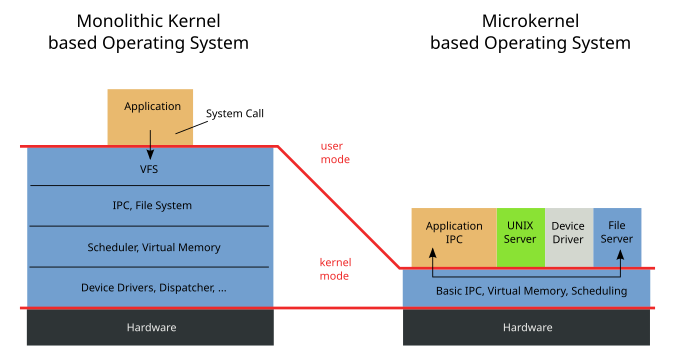

***************************************
History and development of microkernels
***************************************

.. admonition::  Resources

    * `seL4 Whitepaper <https://sel4.systems/About/seL4-whitepaper.pdf>`_
    * `The Nucleus of a Multiprogramming System <https://dl.acm.org/doi/pdf/10.1145/362258.362278>`_
    * `Mach:  A system software kernel <https://www.sciencedirect.com/science/article/abs/pii/0956052190900045>`_
    *  `Improving the reliability of commodity operating systems <https://doi.org/10.1145/1047915.1047919>`_
    *  `W01a:  Introduction to microkernels and seL4 <https://youtu.be/IvqM2pmApSY?si=iLINPha0RPT0d1dJ>`_

Microkernels are a type of operating system kernel designed to handle only the most essential core functions, such as inter-process communication (IPC), basic scheduling, and low-level hardware abstraction. Unlike monolithic kernels, which encompass a wide range of system services within the kernel space, microkernels adopt a minimalist approach, delegating most functionality, such as device drivers, file systems, and networking, to user-space processes. This separation enhances modularity and fault isolation, as a failure in one user-space component is less likely to crash the entire system. By focusing on minimalism, microkernels aim to improve system reliability, security, and maintainability, making them suitable for applications in embedded systems, real-time environments, and safety-critical domains.

    Structure of monolithic and microkernel-based operating systems. (*source:* Wikipedia)

The debate between monolithic kernels and microkernels centers on trade-offs in performance, complexity, and design philosophy. Monolithic kernels are often favored for their high performance and simplicity in communication between components, as all services operate within a single kernel space. However, this integration increases the risk of system-wide failures and makes updates more challenging. Microkernels, on the other hand, prioritize modularity and robustness, as their smaller codebase and separation of services reduce the attack surface and potential for catastrophic crashes. Critics of microkernels argue that the overhead introduced by frequent IPC calls between the kernel and user-space services can degrade performance. Over time, advancements in hardware and optimization techniques have mitigated some of these concerns, leading to a renewed interest in microkernels for scenarios requiring security, scalability, and fault tolerance.

In the early days of computing, kernel designs were simple and closely tied to the hardware they managed. Early operating systems, such as those for mainframes and batch processing systems, were monolithic in nature, with all essential services bundled together in a single, cohesive codebase. These kernels provided basic functionalities like process management, memory allocation, and I/O handling. Given the limited computational power of early machines, these designs prioritized efficiency over modularity, often at the expense of maintainability and adaptability. The lack of separation between system components meant that updates or bug fixes required changes to the entire kernel, making early systems difficult to evolve as hardware and user requirements advanced.

As computing systems grew in complexity, the limitations of monolithic kernel architectures became evident. The integrated nature of monolithic kernels meant that even minor errors in one part of the system, such as a device driver, could lead to catastrophic system failures. This design also created significant challenges for debugging, extending functionality, and ensuring security. Furthermore, the large codebases of monolithic kernels were prone to bugs and vulnerabilities, increasing the risk of exploitation. These issues highlighted the need for a more modular approach that could isolate faults, simplify updates, and improve overall system resilience. The desire for greater reliability and maintainability in operating system design laid the groundwork for the microkernel paradigm, which aimed to address these shortcomings.

During the 1970s, researchers began to explore alternative kernel designs, emphasizing minimalism and modularity. This period saw the emergence of foundational ideas that would later underpin microkernel development. Researchers investigated the benefits of separating essential kernel functions from higher-level services, arguing that reducing the kernel's responsibilities could lead to more robust and secure systems. Projects such as the pioneering `RC 4000 system`_ laid the theoretical groundwork for microkernels by introducing concepts like message passing for communication between isolated components. This academic focus on system structure, reliability, and fault tolerance provided a theoretical justification for the microkernel approach, influencing the development of early implementations like Mach and shaping the evolution of operating system design in the decades to come.

.. _RC 4000 system: https://en.wikipedia.org/wiki/RC_4000_multiprogramming_system

The 1980s marked the emergence of microkernels as a significant shift in operating system design. During this time, advances in hardware and an increasing demand for more reliable, secure, and adaptable systems drove researchers and engineers to explore alternatives to monolithic kernels. Microkernels became a focus of academic and industrial experimentation, as their minimalist philosophy promised solutions to the challenges posed by monolithic architectures. Key projects, such as the `Mach microkernel`_ at Carnegie Mellon University, helped popularize the microkernel concept by demonstrating its potential for modularity, scalability, and portability. This era laid the foundation for modern microkernel development, showcasing their practical applications and opening new avenues for innovation in operating system design.

Theoretical Motivations
=======================

The microkernel approach is driven by theoretical motivations rooted in simplicity, reliability, and modularity. By reducing the kernel to its most essential functions—such as IPC, basic scheduling, and hardware abstraction—designers aimed to minimize complexity and improve system maintainability. The separation of services into isolated user-space processes allowed for better fault isolation, ensuring that a failure in one service would not compromise the entire system. This modularity also facilitated the development and testing of individual components, as well as their replacement or upgrading without affecting the core kernel. These principles were appealing for systems requiring high reliability, such as embedded devices and safety-critical applications.

Microkernels differ fundamentally from monolithic kernels in their minimalist design philosophy and reliance on user-space services. While monolithic kernels integrate all system services—such as networking, file management, and device drivers—into the kernel space, microkernels delegate these functions to separate user-space processes. This separation reduces the size and complexity of the kernel, improving security and stability by isolating failures. Communication between components in microkernel-based systems relies on IPC mechanisms, which provide a structured way for the kernel and user-space services to interact. Although this design introduces some performance overhead compared to monolithic kernels, it enhances modularity, flexibility, and fault tolerance, making microkernels well-suited for dynamic and secure environments.

Prominent Microkernel Implementations
=====================================

During the 1980s and 1990s, microkernel research gained traction in both academic and commercial contexts, driven by growing interest in modular and reliable system architectures. Universities and research institutions explored microkernels as a means of addressing the limitations of monolithic kernels while providing flexibility for evolving hardware and software demands. Simultaneously, commercial ventures saw the potential of microkernels for specialized applications, particularly in embedded and real-time systems. This period witnessed the rise of experimental microkernel-based operating systems, which demonstrated their scalability, portability, and security benefits. Collaborative efforts between academia and industry led to practical implementations, advancing microkernel concepts beyond theoretical frameworks.

Several microkernel implementations emerged as significant milestones, each highlighting unique strengths and applications of the microkernel approach. These implementations showcased the versatility of microkernels in addressing diverse computing needs.

.. topic:: Mach

    The `Mach microkernel`_, developed at Carnegie Mellon University in the 1980s, was a landmark in the history of microkernel design and became a cornerstone of microkernel research and innovation. Mach extended the ideas of minimalism and modularity by implementing a kernel that handled only basic system services, while functionalities like file systems and device drivers were moved to user-space processes. Its advanced IPC mechanisms, which became a defining feature of microkernels, demonstrated the feasibility of separating core kernel functions from user-space services. Additionally, Mach's support for multi-threading and distributed computing showcased its adaptability for diverse system requirements. Widely adopted in academic settings, Mach became a popular platform for experimenting with new operating system features and influenced subsequent systems such as `NeXTSTEP <https://en.wikipedia.org/wiki/NeXTSTEP>`_ and macOS, where it served as a foundational component. Its modularity, extensibility, and practical applications in both research and commercial contexts solidified its enduring legacy in modern operating system design.

.. _Mach microkernel: https://en.wikipedia.org/wiki/Mach_(kernel)

.. topic:: MINIX

    `MINIX`_, a microkernel-based operating system developed by Andrew S. Tanenbaum, was designed primarily as an educational tool to teach operating system concepts. Its simplicity and clear code structure made it a popular choice for students and researchers. Beyond its educational value, MINIX played an indirect but pivotal role in the development of Linux. Linus Torvalds, inspired by MINIX, created the Linux kernel, albeit as a monolithic design. Despite this, MINIX contributed to raising awareness about microkernel principles and the importance of modularity in operating systems.

.. _MINIX: https://en.wikipedia.org/wiki/Minix

.. topic:: QNX

    `QNX`_, a commercially successful microkernel-based operating system, demonstrated the practical advantages of microkernels in real-world applications. Renowned for its reliability, scalability, and real-time performance, QNX became a popular choice for embedded systems, including automotive, medical, and industrial control systems. Its microkernel architecture allowed for fault isolation and efficient resource management, making it ideal for safety-critical environments. QNX's commercial success validated the viability of microkernels in industry, influencing the adoption of similar architectures in other specialized systems.

.. _QNX: https://en.wikipedia.org/wiki/QNX

.. topic:: L4   

    The L4 microkernel represents a significant milestone in the evolution of microkernel design, emerging as a response to the performance challenges faced by earlier microkernels like Mach. Developed by Jochen Liedtke in the mid-1990s, L4 introduced a highly optimized and minimalist architecture that emphasized performance without compromising the fundamental principles of modularity and security inherent to microkernels. By focusing on efficient IPC and reducing the overhead associated with context switching, L4 demonstrated that microkernels could achieve performance levels comparable to monolithic kernels. This achievement revitalized interest in microkernels, influencing both academic research and practical implementations. L4's modular design and portability have made it a foundation for various operating systems and research projects, including security-focused systems and real-time applications. Its legacy lies in proving that microkernels can balance efficiency and flexibility, shaping the trajectory of modern operating system development.

.. topic:: seL4

    The seL4 microkernel is a groundbreaking advancement in microkernel development, renowned for being the first formally verified microkernel. Developed as part of the L4 family at NICTA (now part of CSIRO's Data61) in the late 2000s, seL4 is distinguished by its strong focus on security, reliability, and performance. Formal verification ensures that the seL4 implementation adheres to its specification, making it mathematically proven to be free of certain classes of bugs, including buffer overflows and null-pointer dereferences. This achievement marked a paradigm shift in the microkernel landscape, demonstrating the feasibility of combining high assurance with practical performance. seL4's verification process set a new benchmark for secure system design and established it as a foundation for applications requiring stringent safety and security guarantees, such as aerospace, defense, and critical infrastructure. Its impact on the field underscores the potential of microkernels to deliver robust, high-assurance systems without sacrificing efficiency.

Challenges and Criticism
========================

One of the primary criticisms of early microkernels was their performance overhead compared to monolithic kernels. Since microkernels rely on IPC for interactions between the kernel and user-space services, frequent context switching and message passing introduced latency. In contrast, monolithic kernels allowed services to communicate directly within the kernel space, resulting in faster operations. These performance gaps, especially in systems with high demands on I/O and processing speed, made microkernels less appealing for general-purpose use. However, advancements in IPC optimization, hardware capabilities, and software design have mitigated these early drawbacks over time.

The practicality of microkernels in high-performance systems has been a contentious topic, with proponents emphasizing their modularity and fault isolation while critics point to potential inefficiencies. Supporters argue that microkernels' ability to isolate services enhances security and reliability, making them ideal for environments where these factors are prioritized over raw performance. However, detractors contend that the IPC overhead and the complexity of managing user-space services can hinder performance in systems requiring low-latency operations, such as gaming or high-frequency trading. This debate has persisted, though modern implementations like the L4 microkernel have demonstrated that microkernels can achieve performance comparable to monolithic kernels in many scenarios.

Transitioning traditional systems from monolithic to microkernel architectures poses significant challenges, primarily due to the fundamental differences in design philosophy. Monolithic kernels integrate all system services into a single codebase, while microkernels distribute these services as independent user-space processes. This shift requires extensive rewriting and restructuring of existing software to function within the modular framework of a microkernel. Additionally, developers must address issues related to IPC, resource management, and compatibility with legacy applications. These challenges make the transition time-consuming and resource-intensive, often leading organizations to retain monolithic architectures for existing systems while exploring microkernel solutions for new projects.

Modern Advances and Applications
================================

The late 1990s and 2000s saw a resurgence of interest in microkernels, driven by evolving technology requirements and a growing emphasis on security, modularity, and fault tolerance. The maturation of microkernel concepts and lessons learned from earlier implementations, such as Mach, inspired new designs that addressed performance concerns. As computing expanded beyond traditional desktops and servers into embedded systems and specialized environments, the advantages of microkernels---such as isolation of components and scalability---became increasingly relevant. This renewed interest led to the development of modern microkernels, such as L4, which demonstrated that microkernels could balance performance with flexibility, further validating their practicality.

Advancements in hardware and software optimization have significantly improved the performance of microkernels, addressing one of the major criticisms they faced in their early development. Modern CPUs with faster context switching, hardware-assisted virtualization, and improved cache management have reduced the overhead associated with IPC in microkernel architectures. On the software side, more efficient IPC mechanisms, streamlined scheduling algorithms, and refined system architectures have enabled microkernels to operate with near-monolithic performance. These improvements have made microkernels increasingly viable for high-performance applications while retaining their inherent advantages in modularity and reliability.

.. _L4 family:  https://en.wikipedia.org/wiki/L4_microkernel_family
.. _seL4: https://sel4.systems/

The `L4 family`_ of microkernels, and its security-enhanced variant seL4_, represent significant advancements in microkernel design. L4 was developed to prioritize high performance [L4]_, demonstrating that microkernels could achieve efficiency comparable to monolithic kernels. Its successor, seL4_, took this a step further by becoming the first formally verified microkernel, ensuring mathematical proof of its correctness and security properties. These lightweight microkernels are designed to minimize complexity while providing robust isolation between components, making them ideal for use in critical systems where security and reliability are paramount. The development of L4 and seL4 has set new benchmarks for microkernel performance and trustworthiness.

.. [L4] https://trustworthy.systems/publications/nicta_full_text/8988.pdf

Microkernels have found widespread application in domains such as the Internet of Things (IoT), mobile devices, and safety-critical systems, where modularity, security, and reliability are crucial. In IoT, microkernels provide lightweight and efficient solutions for resource-constrained devices, enabling secure and isolated operation of multiple components. Mobile operating systems use microkernel-based architectures to enhance modularity and adaptability across diverse devices. In safety-critical systems, such as autonomous vehicles, medical devices, and aerospace applications, microkernels like seL4 offer the fault isolation and formal verification needed to ensure high levels of safety and dependability. These diverse applications underscore the versatility and relevance of microkernels in modern computing.

Microkernels have seen significant adoption in specialized environments where their modularity, reliability, and fault isolation capabilities are highly valued. These environments often require systems that can operate under strict resource constraints while maintaining high levels of security and stability. Microkernel-based designs excel in scenarios where components need to be isolated to prevent faults or vulnerabilities in one module from affecting the entire system. From embedded devices to safety-critical applications, microkernels have proven to be an effective solution, providing the flexibility and dependability that these unique contexts demand.

Real-time operating systems have been a natural fit for microkernel architectures, with QNX serving as a prime example of success in this domain. QNX is widely used in automotive systems, industrial control, and other real-time applications due to its low-latency operation, reliability, and scalability. In automotive systems, QNX powers infotainment systems, advanced driver-assistance systems, and autonomous driving platforms, where consistent and deterministic performance is critical. Its modular design allows for the isolation of critical processes, ensuring system stability and safety even in the face of component failures.

Microkernels have also found applications in mobile platforms, with Google's Fuchsia OS serving as a notable example. Fuchsia is built on the Zircon microkernel, which emphasizes scalability, security, and adaptability for a wide range of devices, from smartphones to IoT devices. By adopting a microkernel architecture, Fuchsia achieves better modularity and fault isolation than traditional monolithic systems, allowing for seamless updates and enhanced security. This approach ensures that components such as drivers and services operate independently in user-space, reducing the risk of system-wide failures and enabling Fuchsia to adapt to evolving mobile and IoT ecosystems.

* `Zot <https://www.infoq.com/news/2018/04/google-fuchsia-zircon-early-look/>`_

Microkernels like `seL4`_ have been adopted in security-focused applications, particularly in defense and safety-critical systems, where correctness and isolation are paramount. seL4, the first formally verified microkernel, guarantees mathematical proof of its functionality and security properties, making it an ideal choice for environments where failure is not an option. It is used in military systems, avionics, and medical devices to ensure that critical processes remain isolated and protected from vulnerabilities or malicious attacks. Its ability to provide robust fault isolation and enforce strict security policies has positioned seL4 as a gold standard in systems requiring high levels of trust and reliability.

Comparative Analysis:  Monolithic v. Microkernel
================================================

In modern contexts, the comparison between microkernels and monolithic kernels revolves around their differing priorities and use cases. Monolithic kernels, such as those used in Linux and Windows, are known for their high performance and simplicity in integrating components within a unified kernel space. However, this tight coupling can lead to vulnerabilities, as bugs or security breaches in one component may compromise the entire system. Microkernels, on the other hand, emphasize modularity and isolation by running most services in user-space, which reduces the risk of catastrophic failures. While monolithic kernels dominate general-purpose operating systems, microkernels have gained traction in specialized fields, such as embedded systems, real-time applications, and security-focused environments, where their design principles align better with specific requirements.

Microkernels offer significant advantages in security, modularity, and fault tolerance due to their minimalist and compartmentalized architecture. By isolating services into separate user-space processes, microkernels limit the impact of bugs or security vulnerabilities, ensuring that a failure in one component does not compromise the entire system. This modular design also facilitates easier debugging, testing, and updates, as individual components can be modified or replaced independently of the kernel. Furthermore, the reduced codebase of microkernels minimizes the attack surface, making them inherently more secure than monolithic kernels. These qualities make microkernels particularly attractive for systems that demand high reliability and resilience, such as safety-critical applications and secure computing platforms.

Despite their advantages, microkernels come with trade-offs in complexity and performance overhead. The reliance on IPC for interactions between kernel and user-space services introduces additional latency compared to monolithic kernels, where services communicate directly within the kernel space. This overhead, while reduced by modern optimizations, can still impact performance in latency-sensitive applications. Additionally, the modular architecture of microkernels can increase the complexity of system design and development, requiring careful management of user-space services and IPC. These challenges often make microkernels less appealing for general-purpose or performance-critical systems, though their benefits in security and reliability continue to justify their adoption in specialized contexts.

Advancing High-Assurance Systems with Microkernels
==================================================

In high-assurance systems, where reliability, security, and fault tolerance are paramount, microkernels offer unique advantages for distributed systems and cloud environments. Distributed high-assurance systems, such as those used in critical infrastructure, defense, and financial systems, benefit from microkernels' ability to isolate services and ensure that failures in one node or process do not cascade throughout the system. In cloud environments, where high-assurance requirements demand secure multi-tenancy and strict data integrity, microkernels provide the modularity needed to sandbox workloads and enforce separation between tenants. Their lightweight nature also supports efficient scaling and secure communication across distributed nodes, aligning with the stringent requirements of high-assurance systems. This potential positions microkernels as a key enabler for secure, scalable, and resilient infrastructure in domains where trust and reliability are non-negotiable.

High-assurance systems demand that software architectures, including microkernels, fully leverage next-generation hardware to achieve uncompromising levels of security and performance. Innovations in microkernel design for multi-core processors allow critical applications in safety-critical domains, such as avionics or medical devices, to run isolated on dedicated cores, ensuring that faults or attacks on one process do not impact others. Hardware-assisted virtualization enhances this isolation, providing a strong barrier between system components while maintaining efficiency. Furthermore, microkernels are being tailored to support hardware security features like secure enclaves and trusted execution environments, enabling high-assurance systems to protect sensitive data and computations from unauthorized access.

In high-assurance systems, the integration of microkernel principles into hybrid architectures seeks to combine the performance benefits of monolithic kernels with the security and reliability of microkernels. This approach is particularly relevant in domains such as autonomous vehicles, where both real-time performance and fault isolation are critical. By isolating key components, such as sensor drivers or safety-critical control logic, in microkernel-like environments while allowing less critical components to operate within a monolithic framework, hybrid architectures ensure that the overall system remains secure and resilient. Efforts are also focused on enhancing these hybrid designs through formal verification, particularly for the isolated components, to guarantee their correctness and adherence to high-assurance standards. These hybrid architectures provide a pragmatic pathway to adopting microkernel principles in systems that require both uncompromised reliability and operational efficiency, making them a cornerstone of next-generation high-assurance computing.

Conclusion
==========

The evolution of the microkernel paradigm reflects its resilience and adaptability in addressing the shifting demands of computing over decades. From its early struggles with performance limitations to its modern resurgence in specialized and high-assurance systems, microkernels have demonstrated their enduring value by prioritizing modularity, fault isolation, and security. Their ability to meet the needs of emerging technologies, such as IoT, distributed systems, and next-generation hardware, underscores their relevance in solving contemporary challenges like scalability, reliability, and secure computing. As systems become increasingly interconnected and diverse, the microkernel's principles are poised to play a pivotal role in shaping the future of operating systems. By enabling architectures that balance performance with rigorous security and adaptability, microkernels are likely to drive innovations in cloud infrastructure, safety-critical applications, and secure environments, ensuring they remain a cornerstone of computing in the decades to come.
